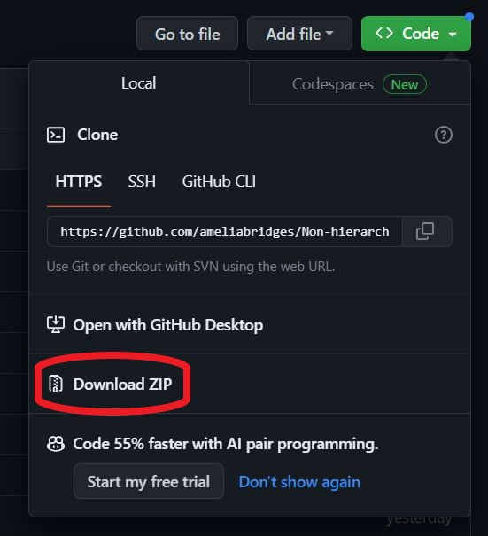

# A Guide to Developing Non-Hierarchical Habitat Classifications Using Open-Source Data & Software

## About this repository

This series of documents were developed by scientists in the University of Plymouth's [Deep Sea Conservation Research Unit](https://deepseacru.org/) as part of a pipeline to assist delegates of the 'Habitat Conservation and Marine Spatial Planning' workshop at the Deep Ocean Collective Solution Accelerator Meeting (Scripps Institution of Oceanography, 2-5th October 2023) in developing regional benthic habitat classifications. The pipeline mirrors that used in [McQuaid et al. (2023)](https://www.sciencedirect.com/science/article/pii/S0079661123000599?via%3Dihub).

  

The work in this demonstration aligns with the [UN Ocean Decade Challenger 150 Programme](https://challenger150.world/) Habitat Mapping Technical Working Group. This group will be formally launched soon so please keep an eye on the website and if you're working in the deep ocean habitat mapping/classification/modelling space, please do join.

  

The [repository](https://github.com/ameliabridges/Non-hierarchical_habitat_classification) is designed to be downloaded as a zip folder and for the scripts to be run sequentially (steps 1 to 3) in the same R Studio session. This document is *not* designed to provide a thorough background in the theory of non-hierarchical habitat classification, nor the variable selection process. For this, we recommend reading [Howell (2010)](https://www.sciencedirect.com/science/article/pii/S0079661123000599?via%3Dihub#bb0400) or the abovementioned McQuaid *et al.* (2023). 

The pipeline assumes a basic knowledge of R language. If you are unfamiliar with this, we recommend looking through the [Software Carpentry lesson “Introduction to R and RStudio”](https://swcarpentry.github.io/r-novice-gapminder/01-rstudio-intro.html) for help with set-up and getting started. 

Should you notice any issues with the code or have any questions, please contact Dr Amelia Bridges at the University of Plymouth [amelia.bridges@plymouth.ac.uk](amelia.bridges@plymouth.ac.uk).

## How to use this repository 

This guidance comprises 3 steps - accessing the data, clustering the input variables and combining the layers to create your benthic habitat classification.

To get started, follow these steps (NB: please make sure you have R and R Studio installed): 

  1. Click on the green 'Code' button & then the 'Download Zip' (circled in red).

  

  2. Unzip the folder in the location you want to work - e.g. Desktop/Documents etc. 

  3. Open the .html files and familiarize yourself with the process and what the outputs look like.

  4. Double-click on the .Rproj file - this will open R Studio. 

  5. In the files panel in R Studio, open the 'Step1_Accessing_the_data' .qmd file*.

  6. Work through the chunks of code in the script until you reach the end. 

  7. **Without removing anything from your R environment or closing R**, open the 'Step2_Clustering_inputs' .qmd file. 

  8. Work through the chunks of code in the script until you reach the end. 

  9. Open the 'Step3_Combining_inputs' .qmd file. 

  10. Work through the chunks of code in the script until you reach the end. 

*The .qmd documents are the scripts used to create the .html files. These allow you to work through the process manually and alter variables/clusters/datasets if you wish. 
